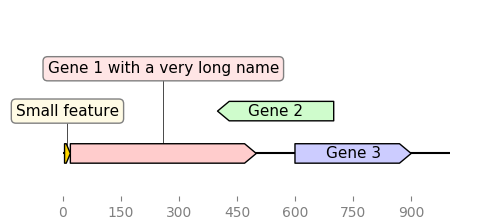
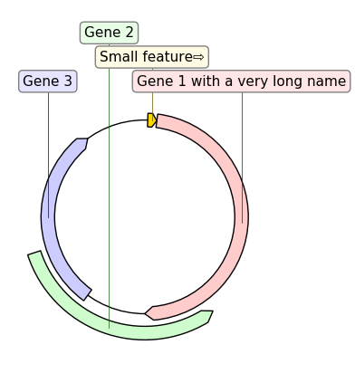
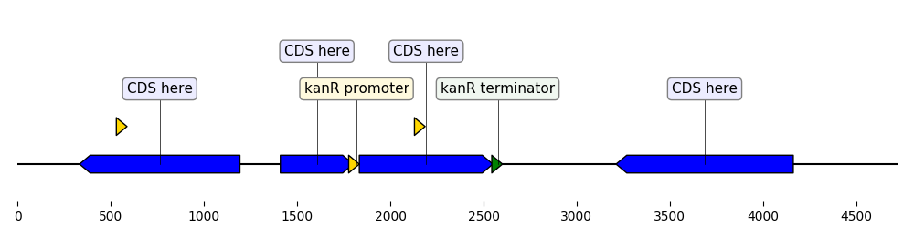
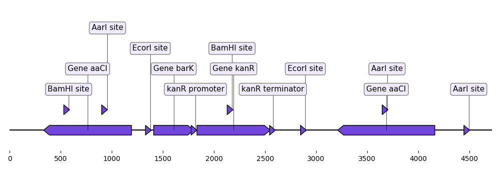
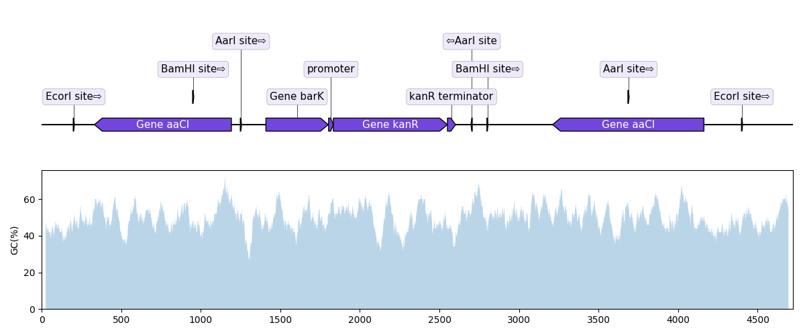
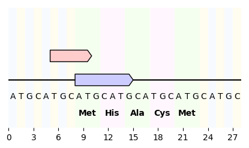
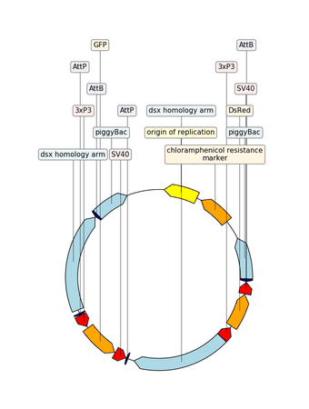

Examples
========

Define a graphic record "by hand"
----------------------------------

.. literalinclude:: ../examples/graphic_record_defined_by_hand.py

Custom Biopython record translator
----------------------------------

.. literalinclude:: ../examples/custom_biopython_translator.py

Load a graphic record from Genbank
----------------------------------

.. literalinclude:: ../examples/from_genbank.py

Plot sequence with GC content plot
------------------------------------

.. literalinclude:: ../examples/with_gc_plot.py

Sequence nucleotides and translation
-------------------------------------

.. literalinclude:: ../examples/sequence_and_translation.py

Example with GIF
------------------

.. literalinclude:: ../examples/example_with_gif.py

